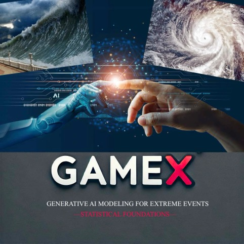
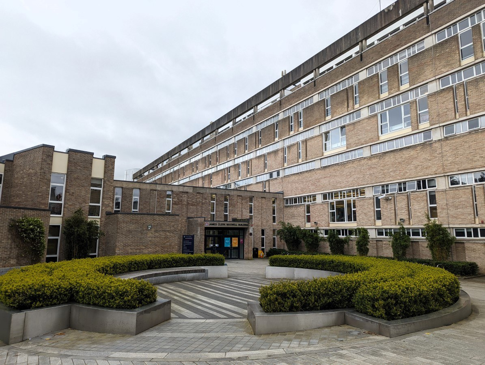
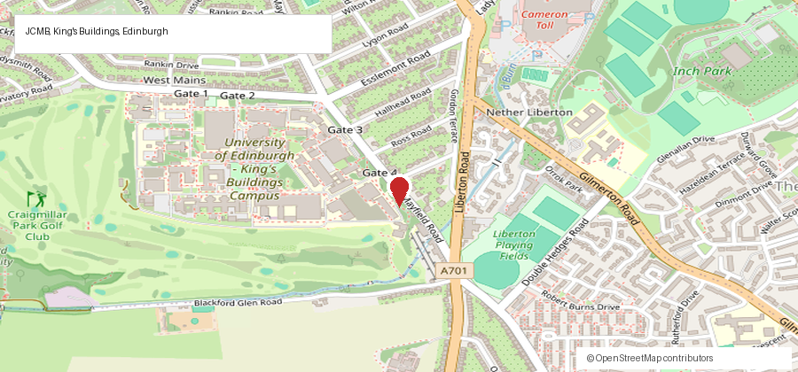

# Edinburgh Summer School on Generative AI for Extremes

  
  

8–11 September 2026 Edinburgh, UK

---

## Overview

Building on the success of [GAME 2025](https://gail.ed.ac.uk/news-and-events/events/generative-ai-modelling-for-extreme-events-2025) in Edinburgh, the first worldwide workshop on generative AI modelling for extreme events, this summer school is led by GLE2N (Glasgow–Edinburgh Extremes Network) and brings PhD students and early-career researchers to the interface of generative AI and extreme value theory. It is an official ECAS course (European Courses in Advanced Statistics), and there is no registration fee.

**Due to exceptionally high interest, registration for the Edinburgh Summer School on Generative AI for Extremes has now closed.**

To be considered if additional places become available, or to join the waiting list, please complete the Expression of Interest form. We will contact you if a place becomes available.

[Expression of Interest](https://forms.office.com/e/MNxd0w0bei){ .md-button .md-button--primary }

## Provisional Programme

| Date | Theme | Agenda |
| --- | --- | --- |
| <strong>Tuesday</strong> <strong>8 Sep</strong> | Foundations and Preparations | Welcome and overview; lectures; practical session; group work and office hours |
| <strong>Wednesday</strong> <strong>9 Sep</strong> | Neural Generative Models | Lectures; practical session; group work and office hours |
| <strong>Thursday</strong> <strong>10 Sep</strong> | Generative Models for Extremes | Lectures; practical session; group photo; group work and office hours |
| <strong>Friday</strong> <strong>11 Sep</strong> | Frontier Topics & Synthesis | Lectures; panel discussion; concluding remarks |

† Further details to be added soon.

## Chair

<strong>Professor Miguel de Carvalho</strong> 
Chair of Statistics &amp; Data Science 
Elected Fellow of Generative AI Laboratory

## Organisers

Johnny Lee (Edinburgh), Lambert de Monte (Edinburgh), Jordan Richards (Edinburgh), Daniela Castro-Camilo (Glasgow), Mengran Li (Glasgow), Teng Wei Yeo (Glasgow), and Luca Trapin (Bologna).

## Materials

Materials will be made available by the instructors in due time. Other resources include selected parts of the [Handbook of Statistics of Extremes](https://extremestats.github.io/Handbook/) and parts of the recent special issue on [Bridging Heavy Tails and AI](https://webhomes.maths.ed.ac.uk/~mdecarv/papers/editorial.pdf).

## Venue

The summer school will take place at **JCMB (James Clerk Maxwell Building)**, University of Edinburgh, Peter Guthrie Tait Road, King’s Buildings, Edinburgh EH9 3FD.

Rooms: **Lecture Theatre B** for lectures and **Teaching Studio 3217** for practical sessions.

<figure class="school-venue-photo">
  
  <figcaption>JCMB, University of Edinburgh.</figcaption>
</figure>

## Accommodation

Participants are responsible for arranging their own accommodation. Options around the King’s Buildings campus include [Glendale Guest House](https://www.glendaleguesthouse.co.uk/) and other guest houses around Mayfield Road, Minto Street, and Newington. The University of Edinburgh’s [Summer Stays booking page](https://www.uoecollection.com/summer-stays-at-the-university-of-edinburgh/summer-stays/bookings#!/accommodation/search/date/2026-09-08/2026-09-11) lists additional accommodation options during the summer period.

## Getting to JCMB

From **Edinburgh Waverley** train station, JCMB is around 3 miles south at the King’s Buildings campus. Allow around 20–30 minutes by bus or taxi, depending on traffic.

[Open route in Google Maps](https://www.google.com/maps/dir/Edinburgh%20Waverley%2C%20Edinburgh/James%20Clerk%20Maxwell%20Building%2C%20Peter%20Guthrie%20Tait%20Road%2C%20Edinburgh%20EH9%203FD){ .md-button .md-button--primary }

## Partners

  

  

  
  
  
  
  
  

