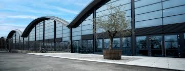
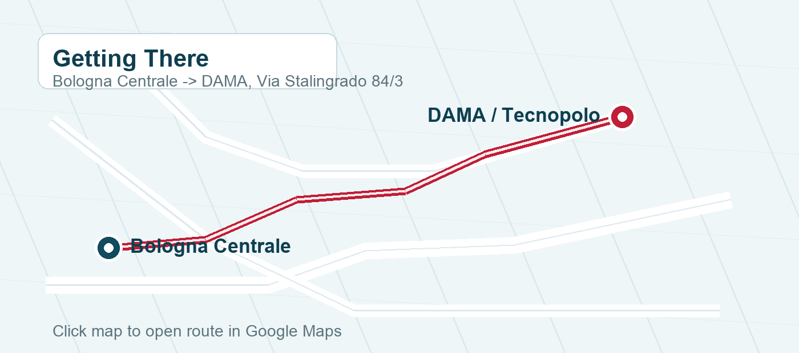
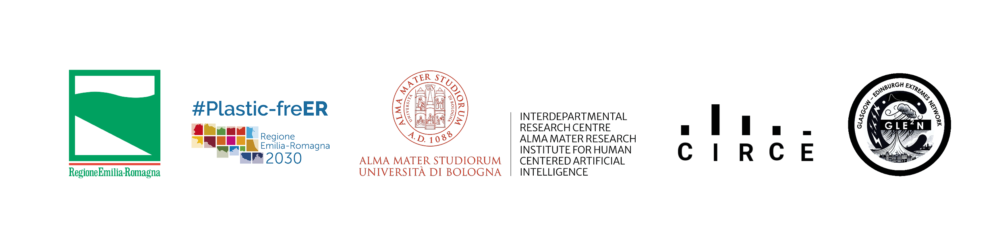

# GAME 2026—Generative AI Modelling for Extreme Events

  
  

11–12 June 2026 Bologna, Italy

---

## Overview

Extreme events—such as market crashes, wildfires, unprecedented flooding, intense hurricanes, and extreme heatwaves—cause major disruptions across societal and ecological systems. Accurately modelling and simulating such rare, high-impact phenomena remains one of the central challenges in statistics, machine learning, and risk analysis.

The **Generative AI Modelling for Extreme Events (GAME 2026)** workshop aims to stimulate discussion on the use of generative models for extreme events and to promote the exploration of novel research directions in this rapidly emerging area.

The event will focus on both the opportunities and current challenges of using generative models to simulate extreme phenomena, particularly in high-dimensional and sparse-data settings.

A central objective of the workshop is to foster dialogue between the **Statistical Learning and Generative Modelling community** and researchers in **Extreme Value Theory, climate science, and financial risk assessment**. By bringing together experts from these domains, the workshop seeks to encourage cross-disciplinary exchange and identify promising avenues for joint research.

---

## Registration

Registration is free but mandatory due to limited capacity.

To check availability and register for the workshop, please contact Luca Trapin at:  
[luca.trapin@unibo.it](mailto:luca.trapin@unibo.it)

---

## Preliminary Programme

The preliminary programme is reported below. Talk titles and further details will be announced soon.

### Day 1—Thursday, 11 June 2026

| Time | Speaker / Details | Affiliation |
|---|---|---|
| 13:00 – 13:30 | Registration |  |
| 13:30 – 14:00 | Opening—Introduction to the Workshop |  |
| 14:00 – 14:30 | Miguel de Carvalho | University of Edinburgh |
| 14:30 – 15:00 | Giorgia Ramponi | University of Zurich |
| 15:00 – 15:30 | Luis Alberto Gutiérrez Inostroza | Pontificia Universidad Católica de Chile |
| 15:30 – 16:00 | **Coffee break** |  |
| 16:00 – 16:30 | Sebastian Engelke | University of Geneva |
| 16:30 – 17:00 | Maud Thomas | Université Lyon 1 |
| 17:00 – 17:30 | Likun Zhang | University of Missouri |

---

### Day 2—Friday, 12 June 2026

| Time | Speaker / Details | Affiliation |
|---|---|---|
| 09:30 – 10:00 | Antonio Tirri & Melchiorre Danilo Abrignani | Leithà – Unipol Group |
| 10:00 – 10:30 | Antonello Squintu | CMCC |
| 10:30 – 11:00 | Matteo Angelinelli | CINECA HPC |
| 11:00 – 11:30 | **Coffee break—Group photo** |  |
| 11:30 – 12:00 | Olivier Lopez | CREST – ENSAE IP Paris |
| 12:00 – 12:30 | Alison Peard | University of Oxford |
| 12:30 – 13:00 | Ashley Turner | Imperial College London |
| 13:00 – 14:00 | **Lunch break** |  |
| 14:00 – 14:30 | Amir Khorrami Chokami | University of Cagliari |
| 14:30 – 15:00 | Nathan Huet | Ca' Foscari University of Venice |
| 15:00 – 15:30 | Jean Pachebat | École Polytechnique |
| 15:30 – 16:00 | **Coffee break** |  |
| 16:00 – 16:30 | Jordan Richards | University of Edinburgh |
| 16:30 – 17:00 | Daniela Castro-Camilo | University of Glasgow |
| 17:00 – 17:30 | Johnny Lee | University of Edinburgh |

Programme details and talk titles will be updated in due course.
 
---

## Organizing Committee

Luca Trapin (University of Bologna) 

Massimo Ventrucci (University of Bologna)

---

## Venue

**Area Botte B4**  
DAMA—Tecnopolo Data Manifattura Emilia-Romagna  
Via Stalingrado 84/3  
40128 Bologna (BO), Italy  

<figure class="school-venue-photo">
  
  <figcaption>DAMA—Tecnopolo Data Manifattura Emilia-Romagna.</figcaption>
</figure>

### Getting There

From **Bologna Centrale railway station**:

- Take bus **Line 25**
- Get off at **Casoni** stop
- Walk along Via Casoni until the intersection with Via Stalingrado
- Turn left onto Via Stalingrado

[Open route in Google Maps](https://www.google.com/maps/dir/Bologna%20Centrale%2C%20Bologna/DAMA%20Tecnopolo%20Data%20Manifattura%20Emilia-Romagna%2C%20Via%20Stalingrado%2084%2F3%2C%2040128%20Bologna%20BO%2C%20Italy){ .md-button .md-button--primary }

---

## Partners

{: style="display:block; margin: 0 auto; width: 200%;" }
